# ShipAI (`@dadsnpm/shipai`) 🚀

[](https://www.npmjs.com/package/@dadsnpm/shipai)
[](https://opensource.org/licenses/MIT)
[](https://nodejs.org/)
[](https://github.com/alivirgo/shipai)
[](https://www.typescriptlang.org/)

> **Transform raw, chaotic AI-agent prototypes into enterprise-grade, production-hardened, and 100% bespoke client software solutions.**

---

## 🌪️ The Real-World AI Prototype Dilemma

Modern coding agents (**Claude Code, Cursor, Grok, ChatGPT, Devin, Windsurf, Bolt, Lovable, v0, Aider**) enable developers and agencies to build functional AI prototypes in record time. However, when delivering to paying clients or non-technical enterprise teams, projects suffer from critical flaws:

| Problem in AI Prototypes | Real-World Danger / Impact | How ShipAI Solves It |
|---|---|---|
| **AI Slop & Watermarks** | Comments like `// Generated by Claude 3.5 Sonnet`, `// Note: In production you should...`, and fake sleep delays `await new Promise(r => setTimeout(r, 1000))` expose that the codebase is an unpolished AI hackathon demo. | **AI Slop & Watermark Cleaner**: Syntax-aware removal of agent comments, fake mock sleep hacks, and lazy disclaimers across TypeScript, JavaScript, and Python. |
| **API Failure / Demo Crashes** | When clients try running the prototype without API keys or run out of credits, unhandled exceptions cause immediate app crashes during demos. | **Self-Healing Universal Gateway**: Auto-failovers across OpenAI, Azure, Claude, Gemini, DeepSeek, and Ollama + **Deterministic Offline Demo Mode** (`OFFLINE_DEMO_MODE=true`). |
| **Old Prototype Traces** | Original project names, author handles, and legacy URLs lurk in AST identifiers, JSX tags, route strings, DB schemas, and package metadata. | **Compiler-Grade AST Rebrander**: TypeScript Compiler API node replacement across 8 casing conventions (`PascalCase`, `camelCase`, `kebab-case`, `snake_case`, `CONSTANT_CASE`, `Title Case`, etc.). |
| **Unknown Operating Costs** | Clients demand: *"How much will this cost per month to run?"* Prototypes offer zero visibility into token economics. | **Token & Financial OpEx Modeler** (`shipai cost`): Scans LLM call-sites and projects monthly costs at 1k, 10k, 100k, and 1M queries across 8 frontier models. |
| **Legal & IP Ambiguity** | Agencies risk copyright infringement or GPL copyleft viral contamination in client handoffs. | **IP Clearance & Warranty Suite**: Generates signed commercial `WARRANTY_AND_IP_CLEARANCE.md`, `CLIENT_DEMO_SCRIPT.md`, and NIST/EU-compliant `AI_SYSTEM_CARD.md`. |
| **Client IT Onboarding** | Non-technical client teams struggle with environment variables, database setup, and runtime dependencies. | **Self-Contained Pre-Flight Diagnostics**: Injects `npm run diagnose` and interactive onboarding wizard `npm run setup` for zero-friction client deployment. |

---

## ⚡ Quickstart

### 1. Interactive Web Studio (Local Visual Dashboard)
Launch the dark-mode Studio dashboard with live health radar, color palette customizer, OpEx simulator, and unified diff inspector:

```bash
npx @dadsnpm/shipai studio
```
*Opens `http://localhost:4488` in your browser.*

### 2. Interactive CLI Prompt Wizard
Run the step-by-step terminal wizard:

```bash
npx @dadsnpm/shipai
```

### 3. Global Installation
```bash
npm install -g @dadsnpm/shipai
# Then run anywhere:
shipai
```

### 3. One-Command Complete Transformation
Run the full end-to-end pipeline (Audit ➔ Sanitize ➔ Rebrand ➔ Pack ➔ Model Costs ➔ Verify):

```bash
npx shipai full --from ChatPilot --to OmniDesk --client "Apex Global" --color "#0ea5e9"
```

### 4. Programmatic SDK (Node.js & CI/CD)
```ts
import { shipAI } from 'shipai';

const summary = await shipAI({
  rootDir: process.cwd(),
  sourceName: 'ChatPilot',
  targetName: 'OmniDesk',
  clientName: 'Apex Global',
  brandColor: '#0ea5e9',
  modules: {
    audit: true,
    sanitize: true,
    cleanAiSlop: true,
    rebrand: true,
    pack: true,
    docker: true,
    universalGateway: true,
    costReport: true,
    diagnostics: true,
    verify: true
  }
});

console.log(`Ship Score: ${summary.shipScore}/100. Ready: ${summary.isReadyToShip}`);
```

---

## 🏛️ Comprehensive Architecture & Pillars

```mermaid
graph TD
    A[Raw AI Prototype] --> B[ShipAI Enterprise OS]
    
    subgraph "Pillar 1: Forensic Audit & De-AI Sanitization"
    B --> C[Shannon Entropy Scanner: H >= 4.3]
    B --> D[Client-Side Leak Detector: NEXT_PUBLIC_* / VITE_*]
    B --> E[License Compliance: GPL/AGPL Copyleft Detector]
    B --> F[AI Slop Cleaner: Agent Comments & Fake Sleep Delays]
    end
    
    subgraph "Pillar 2: AST Semantic Rebranding & Theming"
    B --> G[TypeScript Compiler AST Node Transformer]
    B --> H[8-Way Multi-Casing Replacement Engine]
    B --> I[11-Shade Color Palette Generator: 50-950]
    B --> J[Vector SVG Brand Assets: Logo, Favicon, Touch, OpenGraph]
    B --> K[Database Schema & Migration Rebrander: Prisma/Drizzle/SQL]
    B --> L[Python Ecosystem Rebrander: FastAPI & pyproject.toml]
    end
    
    subgraph "Pillar 3: Resilient Infrastructure & Universal AI Gateway"
    B --> M[Universal Multi-LLM Bridge with Auto-Failover]
    B --> N[Deterministic Offline Client Demo Mode]
    B --> O[Multi-Stage Alpine Docker + Redis Cache Stack]
    B --> P[Caddy Reverse Proxy with Automated TLS & HSTS]
    B --> Q[Kubernetes Manifests & DevContainers for Codespaces]
    B --> R[AI Cost Guardrails: Token Bucket + Budget Ceiling]
    end
    
    subgraph "Pillar 4: Financial OpEx & Executive Delivery Suite"
    B --> S[Token & Monthly OpEx Modeler: shipai cost]
    B --> T[Pre-Flight Client Diagnostic Runner: npm run diagnose]
    B --> U[IP Clearance Warranty & Non-Infringement Certificate]
    B --> V[10-Minute Executive Client Demonstration Script]
    B --> W[NIST / EU AI Act Responsible AI System Card]
    B --> X[Pristine Git Handoff: Clean v1.0.0 Tag]
    end
```



---

## 🛠️ CLI Subcommands Reference

### 🔍 1. Forensic Audit (`shipai audit`)
```bash
npx shipai audit [directory]
```
- Scans for hardcoded LLM provider keys (`sk-...`, Anthropic, Gemini, DeepSeek, Pinecone, Supabase, AWS).
- **Client-Side Leak Detection**: Flags dangerous `NEXT_PUBLIC_*_KEY` and `VITE_*_SECRET` exposures.
- **Shannon Entropy Analysis**: Detects obscured cryptographic secrets ($H \ge 4.3$).
- **License Risk Scanner**: Flags copyleft licenses (GPL/AGPL) that jeopardize commercial exclusivity.
- Emits a holistic 0–100 **Ship-Readiness Score**.

### 🧹 2. AI Slop & Code Sanitizer (`shipai sanitize`)
```bash
npx shipai sanitize [directory] [--dry-run]
```
- Scrubs agent scratchpads and prompt logs (`.cursorrules`, `.cursor/`, `claude.md`, `.windsurf/`).
- **Deep Code Comment Cleaning**: Purges agent watermarks (`// Generated by Claude`, `// Windsurf Cascade`, `/* v0 by Vercel */`, `# Generated by ChatGPT`).
- **Simulated Sleep Delay Removal**: Removes hacky `await new Promise(r => setTimeout(r, 1000))` delays used by AI agents to simulate LLM thinking.
- Masks leaked API keys with safe environment variable placeholders.

### 🎨 3. AST Semantic Rebranding (`shipai rebrand`)
```bash
npx shipai rebrand --from ChatPilot --to OmniDesk --client "Apex Global" --color "#0ea5e9"
```
- Employs the **TypeScript Compiler API** (`ts.transform`) to rename identifiers, classes, interfaces, and JSX elements with grammatical precision.
- **8-Way Casing Matrix**: Handles `PascalCase`, `camelCase`, `kebab-case`, `snake_case`, `CONSTANT_CASE`, `Title Case`, and sentence case.
- **Theme Engine**: Generates an 11-shade perceptual color palette (`50` through `950`) and injects CSS variables and Tailwind configuration tokens.
- **Vector Brand Assets**: Generates bespoke SVG vector logos, client favicons, Apple touch icons, and high-resolution OpenGraph cards (`1200x630`).
- **Database & Python Schemas**: Renames models and connection strings in Prisma (`schema.prisma`), Drizzle, SQL migrations, and FastAPI applications.

### 💰 4. AI Cost & OpEx Forecaster (`shipai cost`)
```bash
npx shipai cost [directory]
```
- Statically scans LLM call sites and prompt architectures.
- Models monthly operating expenditure across 8 frontier models at **1,000**, **10,000**, **100,000**, and **1,000,000** queries/month.
- Computes Prompt Caching savings (50–90% discounts).
- Emits executive projection report: `AI_COST_AND_SCALING_PROJECTION.md`.

### 🩺 5. Client Pre-Flight Diagnostics (`shipai diagnose`)
```bash
npx shipai diagnose [directory]
```
- Generates a standalone, zero-dependency pre-flight diagnostic runner: `scripts/client-diagnostics.mjs`.
- Injects `npm run diagnose` into `package.json` for client IT departments.
- Verifies Node.js runtime version, `.env` completeness, AI credentials, and process memory limits.

### 📦 6. Enterprise Infrastructure Packaging (`shipai pack`)
```bash
npx shipai pack --name omnidesk --client "Apex Global"
```
- Multi-stage Alpine container (`Dockerfile`, `.dockerignore`, `docker-compose.yml` with Redis service).
- **Universal Multi-LLM Gateway Bridge**: Seamless switching between OpenAI, Azure, Anthropic, Gemini, DeepSeek, Grok, and Ollama.
- **AI Cost Guardrails**: Injects token bucket rate-limiting and daily dollar budget circuit breakers.
- Production Caddy reverse proxy with automatic TLS, HSTS, and CSP headers.
- Cloud deployment blueprints (`railway.json`, `render.yaml`, `vercel.json`).
- Kubernetes manifests (`k8s/deployment.yaml`, `service.yaml`, `ingress.yaml`).
- `.devcontainer/devcontainer.json` for instant GitHub Codespaces onboarding.

### 🛡️ 7. Pre-Ship Verification Gate (`shipai verify`)
```bash
npx shipai verify [directory]
```
- Automated 10-point pre-flight verification gate testing buildability, zero-secret exposure, container configuration, documentation completeness, and guardrail presence.
- Emits `VERIFICATION_REPORT.json`.

### 📜 8. Executive Client Deliverables Suite
ShipAI automatically generates a complete suite of executive and operational documents:
- `README.md` — Branded executive presentation with interactive Mermaid architecture diagram.
- `ARCHITECTURE.md` — Complete technical specifications, request lifecycles, and security posture.
- `DEPLOYMENT_RUNBOOK.md` — Step-by-step production runbooks for AWS, DigitalOcean, Railway, Render, and Vercel.
- `USER_MANUAL.md` — User manual designed specifically for non-technical client employees.
- `ADMIN_OPERATIONS_GUIDE.md` — IT operations guide for API key rotation and telemetry.
- `WARRANTY_AND_IP_CLEARANCE.md` — Formal commercial warranty certifying non-infringement, absence of copyleft licenses, and clean IP assignment.
- `CLIENT_DEMO_SCRIPT.md` — 10-minute agency-to-client walkthrough presentation script.
- `AI_SYSTEM_CARD.md` — NIST AI RMF / EU AI Act responsible AI system card.
- `DELIVERY_CERTIFICATE.md` — Cryptographic delivery certificate with SHA-256 integrity checksums.

### 🧼 9. Pristine Git Handoff (`shipai handoff`)
```bash
npx shipai handoff --client "Apex Global" --project "OmniDesk"
```
- Archives messy commit history (`fix bug`, `try claude prompt again`) and initializes a pristine, single-commit client release repository tagged at `v1.0.0`.

---

## 🧩 Programmatic Node.js SDK

```typescript
import {
  shipAI,
  auditProject,
  sanitizeAiSlop,
  replaceProjectText,
  calculateAiProjectCost,
  generateUniversalAiBridge,
  runPreShipVerification
} from 'shipai';

// 1. Audit codebase
const audit = await auditProject('./my-ai-app');
console.log(`Readiness: ${audit.readinessScore}/100`);

// 2. Calculate AI OpEx costs
const cost = await calculateAiProjectCost('./my-ai-app');
console.log(`Recommended Model: ${cost.recommendedModel}`);

// 3. Complete Automated Bespoke Shipping
const result = await shipAI({
  rootDir: './my-ai-app',
  sourceName: 'ChatPilot',
  targetName: 'OmniDesk',
  clientName: 'Apex Global',
  brandColor: '#0ea5e9'
});

console.log(result.isReadyToShip ? 'All systems verified!' : 'Review issues.');
```

---

## 🧪 Testing & Quality Assurance

ShipAI maintains a comprehensive test suite covering all modules:

```bash
# Run unit & integration tests (55 tests across 25 suites)
npm test

# Type-check TypeScript codebase
npm run lint

# Compile production bundles
npm run build
```

---

## 📄 License

MIT © [ShipAI Contributors](https://github.com/shipai/shipai). Commercial and agency use permitted.
